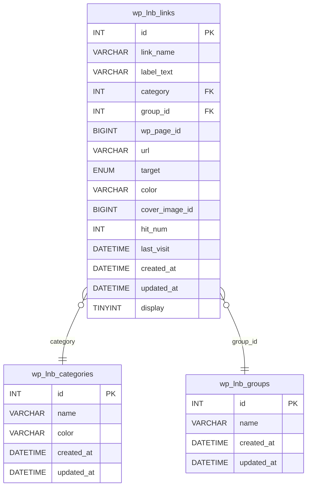

# Database Schema
## Tables
### wp_lnb_categories

| Column     | Type         | Null | Key         | Default           | Description                                   |
|------------|--------------|------|-------------|-------------------|-----------------------------------------------|
| id         | INT          | NO   | PRIMARY KEY | AUTO_INCREMENT    | Category ID                                   |
| name       | VARCHAR(255) | NO   |             |                   | Name of the category                          |
| color      | VARCHAR(7)   | YES  |             |                   | Hex code for category color                   |
| created_at | DATETIME     | NO   |             | CURRENT_TIMESTAMP | Timestamp for when the category was created   |
| updated_at | DATETIME     | NO   |             | CURRENT_TIMESTAMP | Timestamp for the last update to the category |

### wp_lnb_groups

| Column     | Type         | Null | Key         | Default           | Description                                |
|------------|--------------|------|-------------|-------------------|--------------------------------------------|
| id         | INT          | NO   | PRIMARY KEY | AUTO_INCREMENT    | Group ID                                   |
| name       | VARCHAR(255) | NO   |             |                   | Name of the group                          |
| created_at | DATETIME     | NO   |             | CURRENT_TIMESTAMP | Timestamp for when the group was created   |
| updated_at | DATETIME     | NO   |             | CURRENT_TIMESTAMP | Timestamp for the last update to the group |

### wp_lnb_links Table

| Column         | Type                    | Null | Key         | Default           | Description                                                                         |
|----------------|-------------------------|------|-------------|-------------------|-------------------------------------------------------------------------------------|
| id             | INT                     | NO   | PRIMARY KEY | AUTO_INCREMENT    | Unique ID for each link                                                             |
| link_name      | VARCHAR(255)            | NO   |             |                   | Name of the link                                                                    |
| label_text     | VARCHAR(255)            | YES  |             |                   | Label text displayed for the link                                                   |
| category       | INT                     | YES  | FOREIGN KEY |                   | Category ID linking to the categories table                                         |
| group_id       | INT                     | YES  | FOREIGN KEY |                   | Group ID linking to the groups table                                                |
| wp_page_id     | BIGINT UNSIGNED         | YES  |             |                   | ID of the associated WordPress page                                                 |
| url            | VARCHAR(2083)           | YES  |             |                   | The URL of the link                                                                 |
| target         | ENUM('_self', '_blank') | YES  |             | '_blank'          | Specifies if the link opens in the same or new tab                                  |
| color          | VARCHAR(7)              | YES  |             |                   | Hex code for link color                                                             |
| cover_image_id | BIGINT UNSIGNED         | YES  |             |                   | WordPress asset (attachment) ID for cover image                                     |
| hit_num        | INT                     | NO   |             | 0                 | Number of times the link has been accessed                                          |
| last_visit     | DATETIME                | YES  |             | NULL              | Date and time of the most recent visit                                              |
| created_at     | DATETIME                | NO   |             | CURRENT_TIMESTAMP | Timestamp for when the link was created                                             |
| updated_at     | DATETIME                | NO   |             | CURRENT_TIMESTAMP | Timestamp for the last update to the link                                           |
| display        | TINYINT                 | NO   |             | 1                 | Display option for the link: 1 = "Name and Link(s)", 0 = "Name only", -1 = "Hidden" |

## Relationships

- `category` in `wp_lnb_links` is a foreign key referencing `id` in `wp_lnb_categories`.
- `group_id` in `wp_lnb_links` is a foreign key referencing `id` in `wp_lnb_groups`.

## Diagram

## Notes
- `updated_at` in `wp_lnb_links` is managed manually.
- Zero `id` row in `wp_lnb_groups` and `wp_lnb_links` has default meanings.